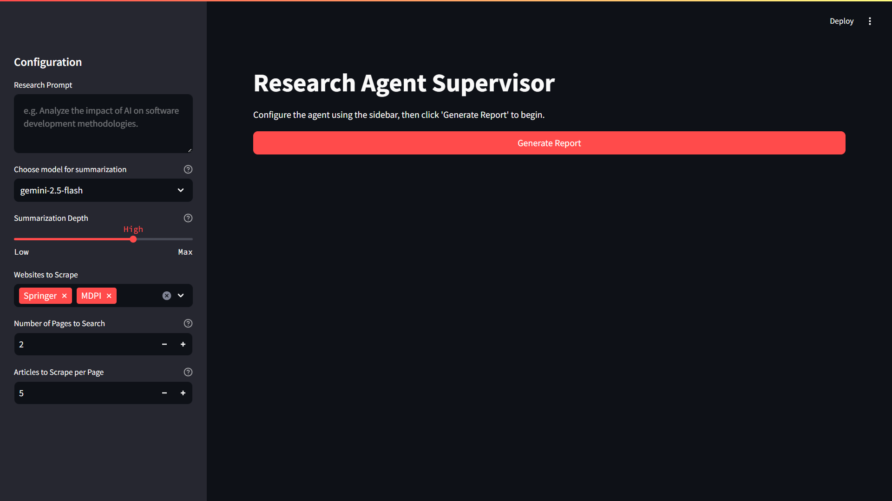
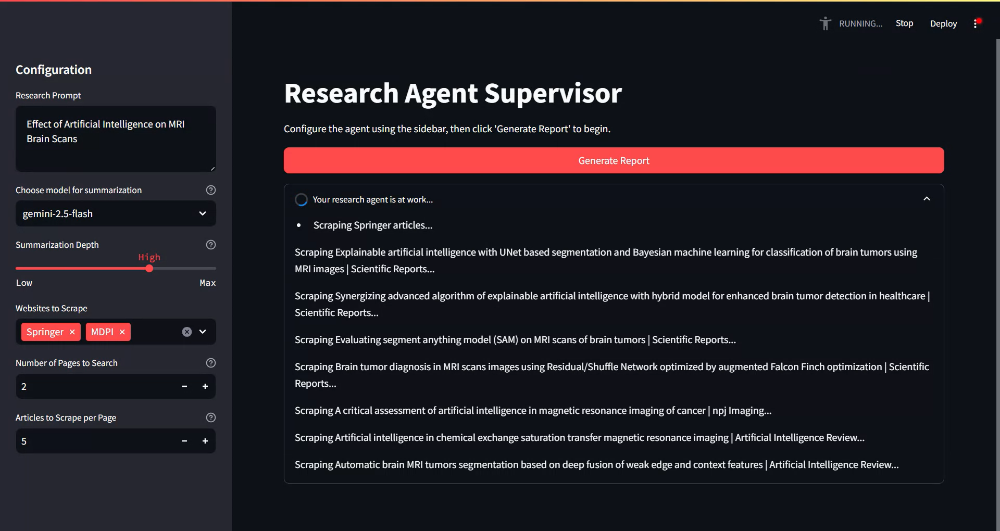
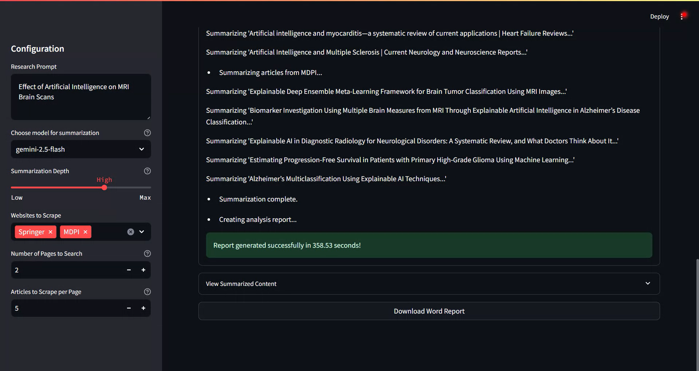

# Autonomous AI Research Agent

This repository contains the source code for an autonomous research agent designed to automate the process of gathering, summarizing, and compiling academic research into a structured report. The agent leverages web scraping to collect articles from specified academic websites, uses a large language model (LLM) for content summarization, and generates a downloadable Word document of the findings. The entire workflow is managed through a user-friendly web interface built with Streamlit, which provides real-time updates on the agent's progress.

---

## Features

- **Multi-Source Scraping:** Gathers research articles from multiple academic platforms, including IEEE Xplore, Springer Link, and MDPI.  
- **AI-Powered Summarization:** Utilizes Google's Gemini models via LangChain to generate concise summaries of scraped articles, focusing on key findings and methodologies.  
- **Automated Report Generation:** Compiles all the summarized content into a professionally formatted Microsoft Word document.  
- **Interactive Web UI:** A clean and intuitive interface built with Streamlit allows for easy configuration of research parameters.  
- **Live Progress Updates:** The UI provides real-time feedback on the agent's status, from scraping web pages to summarizing content.  
- **Customizable Parameters:** Users can easily define the research prompt, select target websites, and control the depth of scraping and summarization.

---

## Demonstration

### Screenshots

Here are a few screenshots of the agent's user interface in action.  


**Caption:** The main configuration panel in the sidebar.


**Caption:** The agent showing real-time logs during the scraping and summarization process.


**Caption:** The final screen showing the collapsible results and the download button for the report.

---

## Live Demo

For a live walkthrough of the application, you can watch the following video:  
[Watch Demo on YouTube](https://youtu.be/SBucI92ACF4)

---

## Installation and Setup

Follow these steps to set up and run the project on your local machine.

### 1. Clone the Repository
```bash


git clone <your-repository-url>
cd <your-repository-directory>
```

### 2. Set Up Environment Variables
This project requires an API key from Google AI Studio to use the Gemini model.

Create a file named .env in the root of the project directory.
Add your API key to this file as follows:

```bash
GEMINI_API_KEY="your_api_key_here"
```

### 3. Install Dependencies

Install all the required Python packages using the requirements.txt file. It is recommended to do this within a virtual environment.
```bash

# Install the required packages
pip install -r requirements.txt
```

### How to Run

Once the setup is complete, you can start the application using the following command in your terminal:

```bash
streamlit run app.py
```

This will launch the Streamlit web server, and the application should automatically open in a new tab in your web browser. From there, you can configure the research parameters in the sidebar and generate your first report.
